# Informações do Projeto
`TÍTULO DO PROJETO`  

IdoS.O.S

`CURSO` 

Ciências da Computação - PUC Minas Coreu

## Participantes

Os membros do grupo sao: 
-Lucas Alkmim Barros 
-Daniela Santos Nacur 
-Livia Camara Xavier 
-Erick Toshio Scarpelli Yamada

# Estrutura do Documento

- [Informações do Projeto](#informações-do-projeto)
  - [Participantes](#participantes)
- [Estrutura do Documento](#estrutura-do-documento)
- [Introdução](#introdução)
  - [Problema](#problema)
  - [Objetivos](#objetivos)
  - [Justificativa](#justificativa)
  - [Público-Alvo](#público-alvo)
- [Especificações do Projeto](#especificações-do-projeto)
  - [Personas, Empatia e Proposta de Valor](#personas-empatia-e-proposta-de-valor)
  - [Histórias de Usuários](#histórias-de-usuários)
  - [Requisitos](#requisitos)
    - [Requisitos Funcionais](#requisitos-funcionais)
    - [Requisitos não Funcionais](#requisitos-não-funcionais)
  - [Restrições](#restrições)
- [Projeto de Interface](#projeto-de-interface)
  - [User Flow](#user-flow)
  - [Wireframes](#wireframes)
- [Metodologia](#metodologia)
  - [Divisão de Papéis](#divisão-de-papéis)
  - [Ferramentas](#ferramentas)
  - [Controle de Versão](#controle-de-versão)
- [**############## SPRINT 1 ACABA AQUI #############**](#-sprint-1-acaba-aqui-)
- [Projeto da Solução](#projeto-da-solução)
  - [Tecnologias Utilizadas](#tecnologias-utilizadas)
  - [Arquitetura da solução](#arquitetura-da-solução)
- [Avaliação da Aplicação](#avaliação-da-aplicação)
  - [Plano de Testes](#plano-de-testes)
  - [Ferramentas de Testes (Opcional)](#ferramentas-de-testes-opcional)
  - [Registros de Testes](#registros-de-testes)
- [Referências](#referências)

# Introdução

## Problema

O envelhecimento da população é uma complexidade de diferentes pontos de vista e é tratado de forma coletiva, porem todos os idosos possuem sua individualidade na maneira de agir, entender e, principalmente, a individualidade na sua condição de vida. O idoso, apesar de ter dificuldades em se readaptar em novas rotinas e situações, alguns ainda o fazem ou tem interesse em fazer. A necessidade do nosso projeto surge do momento em que os idosos começam a perder características cognitivas, físicas e mentais e, consequentemente os problemas do dia a dia enfrentados por eles se intensificam e a qualidade de vida e a saúde são reduzidas. Falhas na memória, perda de visão e audição, maior estresse e perda de força nas pernas e braços são alguns dos diversos problemas que os idosos passam a ter em certa idade, e que dificultam as atividades importantes de casa no dia a dia, como ir no supermercado e consertar objetos em casa, que acabam se tornando tarefas perigosas e podem compromete-los. Com isso, nosso projeto visa ajudar e simplificar os problemas que toda essa parcela da população tem.

## Objetivos

Objetivo geral: desenvolver um software que visa resolver de maneira pratica as dificuldades dos idosos em realizar as tarefas do dia a dia.
Objetivos específicos: 
-Facilitar a busca dos idosos por profissionais próximos que visam atender suas demandas. 
-Organizar de maneira pratica nosso site para facilitar o uso por idosos. 
-Ordenar através de um calendário as tarefas marcadas como forma de lembrete. 
-Aplicar busca por categorias contendo filtros para aumentar a praticidade. 
-Avaliar os profissionais com estrelas para indicar a qualidade do trabalho feito pelo trabalhador. 
-Criar um chat entre cliente e profissional para mais organização, segurança e facilidade para marcar o trabalho.

## Justificativa

A escolha do projeto que estamos trabalhando foi impulsionado tanto por relatos pessoais como também por pesquisas feitas pelo grupo para maior aprofundamento do assunto em questão. Ao analisarmos a dor e a situação enfrentada por essa parcela da população, vimos a necessidade de criar um projeto que facilitasse a vida dos idosos utilizando da tecnologia. Com isso a função do nosso projeto visa tanto a acessibilidade dos idosos para procurar ajuda em suas tarefas, como também disponibilizar aos trabalhadores atendimentos específicos. Assim, o projeto terá foco para idosos e prestadores de serviços, contribuindo para o contato entre os mesmos. 
Fizemos entrevistas para identificarmos melhor a dor das personas do nosso projeto, abaixo colocamos uma das entrevistas que fizemos: 
Entrevista com Perguntas: 

- Boa tarde, tudo bem!? Nós somos estudantes de C.C na PUC, e estamos realizando um trabalho na faculdade com objetivo de entender o comportamento das pessoas. Se você não se sentir à vontade para responder alguma coisa não se sinta pressionado. 

---“olá, tudo bem sim. Ok” 

- O que você gosta de fazer no seu dia a dia? 
--“eu gosto de ver filmes com meu gato e adoro fazer crochê”. 

- Sério? Que legal, a minha vó também faz isso! E você tem alguma dificuldade para fazer isso? 
--“Com isso não, não faço esforço pois fico sentada e acomodada”. 

- Caso não: Mesmo?! Teve alguma outra tarefa que você teve dificuldade pra fazer, por exemplo, ir ao supermercado, padaria? (improviso história da vó) 
--“sim, tenho muita dificuldade de ficar muito tempo em pé e sair de casa, e vou poucas vezes comprar as coisas de cozinha por causa disso”. 

- Caso sim: Entendi, o nosso projeto busca entender essas dificuldades e facilita-las, você acha isso interessante? 

---“acho interessante, ia ficar feliz de ter uma pessoa quando eu preciso ir fazer compras”. 

- Ótimo! Qual a sua opinião a respeito de ter pessoas que apoiem as outras em tarefas diárias? 
--“Acho legal, mas é difícil achar alguém que esteja disponível e confiável pra me ajudar”. 

- (História vó). Isso é interessante ne?! Você gostaria de ter esse tipo de ajuda? 
--“gostaria de ter, ia ser bem mais fácil”. 

- Entendi, e você tem alguma facilidade com aparelhos eletronicos? Porque? (improviso historia do tia) 
--“minha filha me deu um celular, mas tenho dificuldade para mexer, geralmente entro para jogar buraco mas não sei as outras funcionalidades do aparelho”. 

- Caso sim: Legal! É que eu estou desenvolvendo um aplicativo justamente para questõres como essa, que busque ajudar na realização de tarefas. Quais as principais tarefas de casa ou pessoais que você tem alguma dificuldade e gostaria de alguma ajuda? 

---"que legal.Bom aqui em casa tenho dificuldade para limpar a casa, não consigo abaixar e tenho medo de escorregar.Tambem não consigo cozinhar muito pois eu fico com dores na perna e esqueço de as vezes desligar o fogão”. 

- Beleza! Muito obrigado pelas respostas, espero que nosso projeto consiga ajudar pessoas como você. 

## Público-Alvo

Nosso site foi pensado para pessoas idosas utilizarem. Dessa forma, para abranger pessoas com pouco ou razoável conhecimento sobre tecnologias será um website de fácil acesso e com uma linguagem simples. Além disso, foi considerado possíveis dificuldades que atrapalhariam o usuário como visão prejudicada e dificuldade para se locomover. Para isso, o site terá letras maiores e botões mais perceptíveis.  Nossa interface também tem o foco para pessoas mais jovens que pretendem ajudar pessoas mais velhas e até mesmo profissionais que buscam uma forma de rendimento e querem oferecer seu trabalho. Um exemplo é uma senhora, de 71 anos, aposentada, que gosta de cozinhar, mas por dificuldade de mobilidade não consegue ir sozinha ao supermercado e vai buscar em nosso site uma pessoa disposta a ajuda-la nessa tarefa. 

# Especificações do Projeto

......  COLOQUE AQUI O SEU TEXTO ......

> Apresente uma visão geral do que será abordado nesta parte do
> documento, enumerando as técnicas e/ou ferramentas utilizadas para
> realizar a especificações do projeto

## Personas, Empatia e Proposta de Valor

......  COLOQUE AQUI O SEU TEXTO ......

> Relacione as personas identificadas no seu projeto, os respectivos mapas de empatia e 
> mapas da proposta de valor. Lembre-se que você deve ser enumerar e descrever precisamente 
> e de forma personalizada todos os principais envolvidos com a solução almeja. 
> 
> Para tanto, baseie-se tanto nos documentos disponibilizados na disciplina
> e/ou nos seguintes links:
>
> **Links Úteis**:
> - [Persona x Público-alvo](https://flammo.com.br/blog/persona-e-publico-alvo-qual-a-diferenca/)
> - [O que é persona?](https://resultadosdigitais.com.br/blog/persona-o-que-e/)
> - [Rock Content](https://rockcontent.com/blog/personas/)
> - [Hotmart](https://blog.hotmart.com/pt-br/como-criar-persona-negocio/)
> - [Mapa de Empatia](https://resultadosdigitais.com.br/blog/mapa-da-empatia/)
> - [Como fazer um mapa de empatia - Vídeo](https://www.youtube.com/watch?v=JlKHGpVoA2Y)
> - [Canvas da Proposta de Valor](https://analistamodelosdenegocios.com.br/canvas-da-proposta-de-valor/)

**Personas**

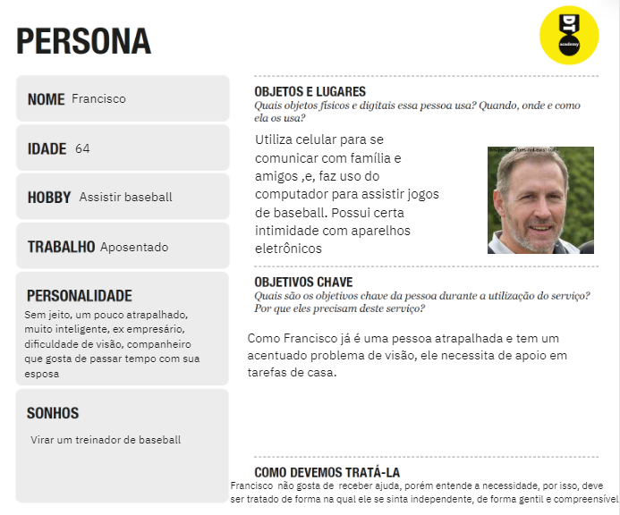
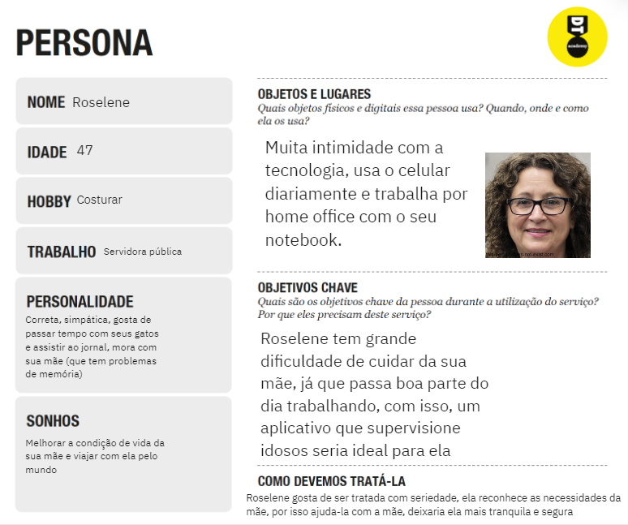
 

**Proposta de Valor**

**Empatia**

## Histórias de Usuários

Com base na análise das personas forma identificadas as seguintes histórias de usuários:

|EU COMO... `PERSONA`| QUERO/PRECISO ... `FUNCIONALIDADE` |PARA ... `MOTIVO/VALOR`                                 |
|--------------------|------------------------------------|--------------------------------------------------------|
|                    |  Filtro                            |  Achar facilmente o profissional ideal                 |
|                    |  Calendário                        |  Lembrar quando o serviço foi marcado                  |
|      Cliente       |  Chat                              |  Combinar o encontro e obter mais segurança            |
|                    |  Avaliar o profissional            |  Recomenda-lo ou não para outros clientes              |
|                    |  Entrar no perfil do profissional  |  Ver as informações básicas e a nota do profissional   |
|                    |  letras grandes/ Interface simples |  Facilitar o uso do site                               |
|--------------------|------------------------------------|--------------------------------------------------------|
|                    |  Avaliar o cliente                 |  Escolher se quero ou não trabalhar para esse cliente  |
|    Profissional    |  Entrar no perfil do cliente       |  Ver as informações básicas e a nota do cliente        |
|                    |  Chat                              |  Combinar dia, preço e local                           |
|--------------------|------------------------------------|--------------------------------------------------------|

> Apresente aqui as histórias de usuário que são relevantes para o
> projeto de sua solução. As Histórias de Usuário consistem em uma
> ferramenta poderosa para a compreensão e elicitação dos requisitos
> funcionais e não funcionais da sua aplicação. Se possível, agrupe as
> histórias de usuário por contexto, para facilitar consultas
> recorrentes à essa parte do documento.
>
> **Links Úteis**:
> - [Histórias de usuários com exemplos e template](https://www.atlassian.com/br/agile/project-management/user-stories)
> - [Como escrever boas histórias de usuário (User Stories)](https://medium.com/vertice/como-escrever-boas-users-stories-hist%C3%B3rias-de-usu%C3%A1rios-b29c75043fac)

## Requisitos

As tabelas que se seguem apresentam os requisitos funcionais e não funcionais que detalham o escopo do projeto.

### Requisitos Funcionais

|ID    | Descrição do Requisito  | Prioridade |
|------|-----------------------------------------|----|
|RF-001| Permitir que o usuário cadastre tarefas | ALTA | 
|RF-002| Emitir um relatório de tarefas no mês   | MÉDIA |

### Requisitos não Funcionais

|ID     | Descrição do Requisito  |Prioridade |
|-------|-------------------------|----|
|RNF-001| O sistema deve ser responsivo para rodar em um dispositivos móvel | MÉDIA | 
|RNF-002| Deve processar requisições do usuário em no máximo 3s |  BAIXA | 

> Com base nas Histórias de Usuário, enumere os requisitos da sua
> solução. Classifique esses requisitos em dois grupos:
>
> - [Requisitos Funcionais (RF)](https://pt.wikipedia.org/wiki/Requisito_funcional):
>   correspondem a uma funcionalidade que deve estar presente na
>   plataforma (ex: cadastro de usuário).
>
> - [Requisitos Não Funcionais (RNF)](https://pt.wikipedia.org/wiki/Requisito_n%C3%A3o_funcional):
>   correspondem a uma característica técnica, seja de usabilidade,
>   desempenho, confiabilidade, segurança ou outro (ex: suporte a
>   dispositivos iOS e Android).
>
> Lembre-se que cada requisito deve corresponder à uma e somente uma
> característica alvo da sua solução. Além disso, certifique-se de que
> todos os aspectos capturados nas Histórias de Usuário foram cobertos.
> 
> **Links Úteis**:
> 
> - [O que são Requisitos Funcionais e Requisitos Não Funcionais?](https://codificar.com.br/requisitos-funcionais-nao-funcionais/)
> - [O que são requisitos funcionais e requisitos não funcionais?](https://analisederequisitos.com.br/requisitos-funcionais-e-requisitos-nao-funcionais-o-que-sao/)

## Restrições

O projeto está restrito pelos itens apresentados na tabela a seguir.

|ID| Restrição                                             |
|--|-------------------------------------------------------|
|01| O projeto deverá ser entregue até o final do semestre |
|02| Não pode ser desenvolvido um módulo de backend        |

> Enumere as restrições à sua solução. Lembre-se de que as restrições
> geralmente limitam a solução candidata.
> 
> **Links Úteis**:
> - [O que são Requisitos Funcionais e Requisitos Não Funcionais?](https://codificar.com.br/requisitos-funcionais-nao-funcionais/)
> - [O que são requisitos funcionais e requisitos não funcionais?](https://analisederequisitos.com.br/requisitos-funcionais-e-requisitos-nao-funcionais-o-que-sao/)

# Projeto de Interface

......  COLOQUE AQUI O SEU TEXTO DE INTRODUÇÃO ......

> Apresente as principais interfaces da solução. Discuta como 
> foram elaboradas de forma a atender os requisitos funcionais, não
> funcionais e histórias de usuário abordados nas [Especificações do
> Projeto](#especificações-do-projeto).

## User Flow

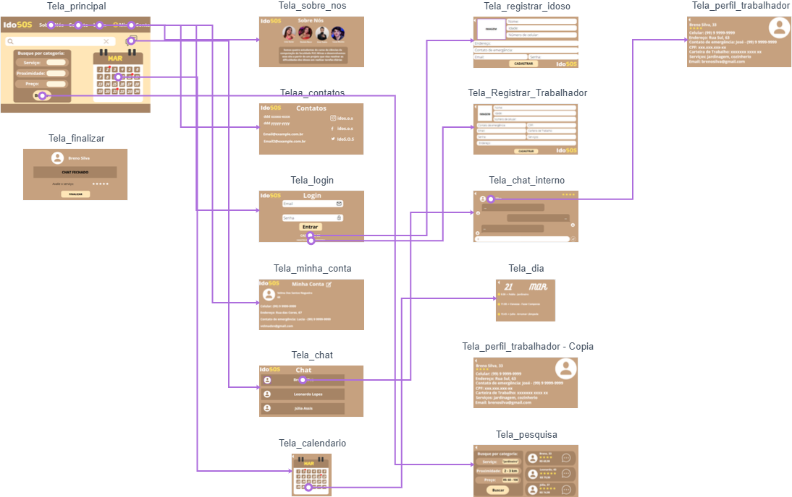

## Wireframes

-Tela Principal:
 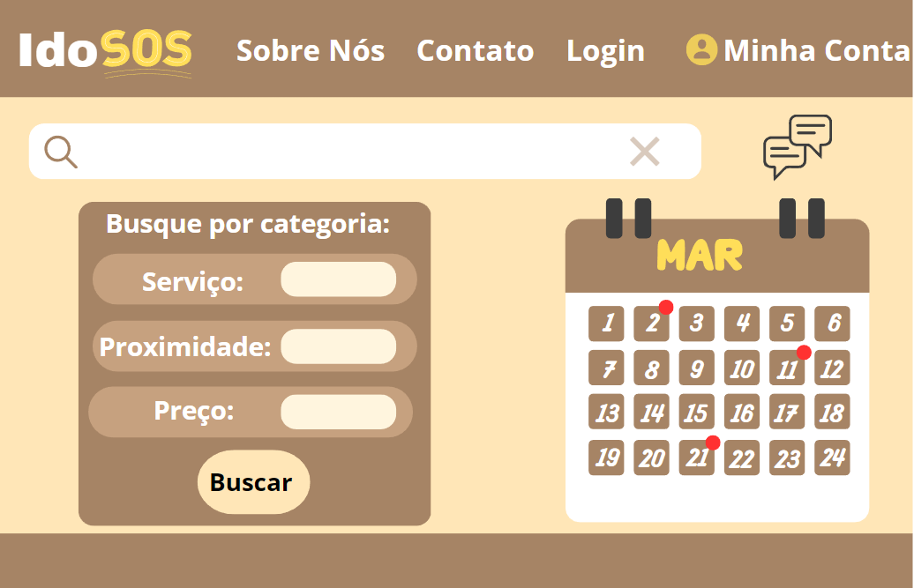
  -Tela Sobre Nós:
 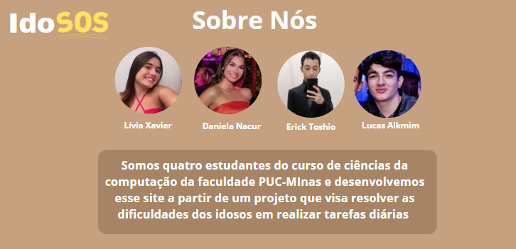
  -Tela Contatos:
 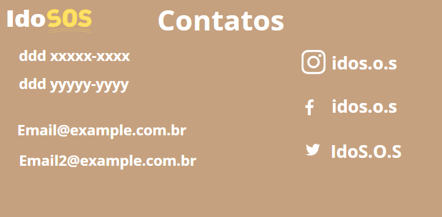
  -Telas Chat:
 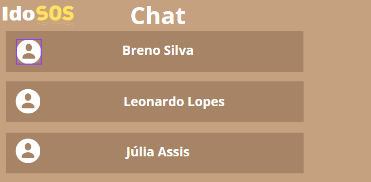
 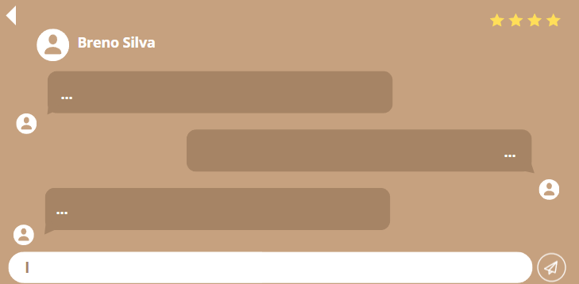
  -Tela Perfil Traabalhador:
 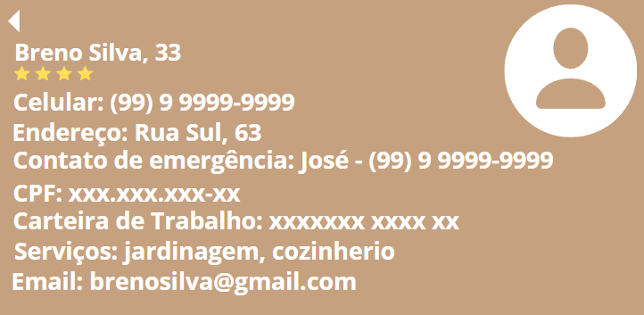
  -Tela Finalizar Serviço: 
 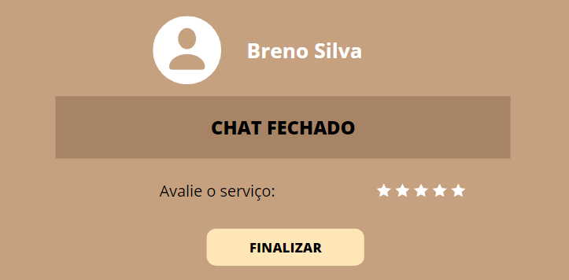
  -Tela Login:
 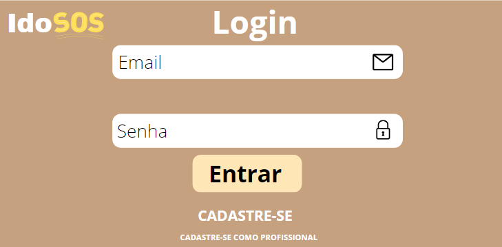
  -Tela Registrar Idoso:
 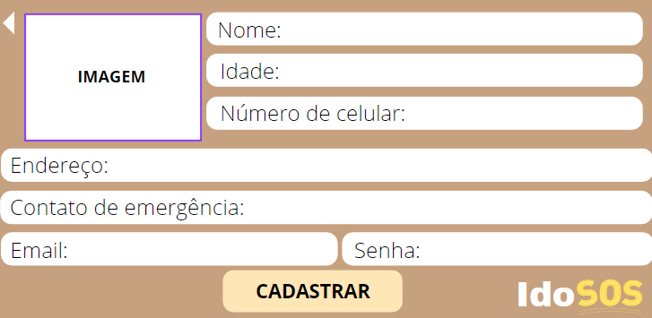
  -Tela Registrar Trabalhador:
 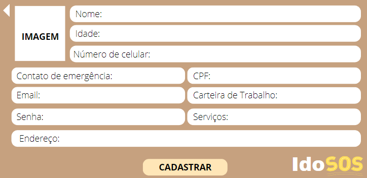
  -Tela Pesquisa:
 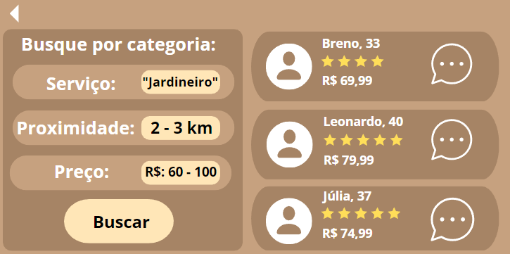
  -Tela Calendário:
 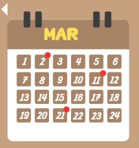
 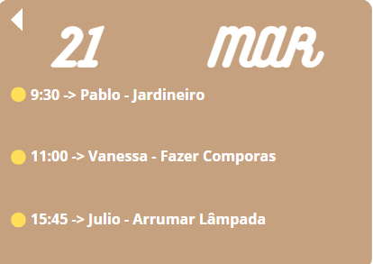
  -Tela Minha Conta:
 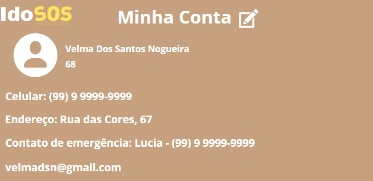

# Metodologia

......  COLOQUE AQUI O SEU TEXTO ......

> Nesta parte do documento, você deve apresentar a metodologia 
> adotada pelo grupo, descrevendo o processo de trabalho baseado nas metodologias ágeis, 
> a divisão de papéis e tarefas, as ferramentas empregadas e como foi realizada a
> gestão de configuração do projeto via GitHub.
>
> Coloque detalhes sobre o processo de Design Thinking e a implementação do Framework Scrum seguido
> pelo grupo. O grupo poderá fazer uso de ferramentas on-line para acompanhar
> o andamento do projeto, a execução das tarefas e o status de desenvolvimento
> da solução.
> 
> **Links Úteis**:
> - [Tutorial Trello](https://trello.com/b/8AygzjUA/tutorial-trello)
> - [Gestão ágil de projetos com o Trello](https://www.youtube.com/watch?v=1o9BOMAKBRE)
> - [Gerência de projetos - Trello com Scrum](https://www.youtube.com/watch?v=DHLA8X_ujwo)
> - [Tutorial Slack](https://slack.com/intl/en-br/)

## Divisão de Papéis

......  COLOQUE AQUI O SEU TEXTO ......

> Apresente a divisão de papéis e tarefas entre os membros do grupo.
>
> **Links Úteis**:
> - [11 Passos Essenciais para Implantar Scrum no seu Projeto](https://mindmaster.com.br/scrum-11-passos/)
> - [Scrum em 9 minutos](https://www.youtube.com/watch?v=XfvQWnRgxG0)

## Ferramentas

......  COLOQUE AQUI O SEU TEXTO - SIGA O EXEMPLO DA TABELA ABAIXO  ......

| Ambiente  | Plataforma              |Link de Acesso |
|-----------|-------------------------|---------------|
|Processo de Design Thinkgin  | Miro |  [https://miro.com/app/board/uXjVMU67v40=/](https://miro.com/app/board/uXjVMU67v40=/) | 
|Repositório de código | GitHub | https://github.com/XXXXXXX | 
|Hospedagem do site | Heroku |  https://XXXXXXX.herokuapp.com | 
|Protótipo Interativo | MavelApp ou Figma | [https://marvelapp.com/prototype/882c0fc](https://marvelapp.com/prototype/882c0fc) | 

>
> Liste as ferramentas empregadas no desenvolvimento do
> projeto, justificando a escolha delas, sempre que possível.
> 
> As ferramentas empregadas no projeto são:
> 
> - Editor de código.
> - Ferramentas de comunicação
> - Ferramentas de diagramação
> - Plataforma de hospedagem
> 
> O editor de código foi escolhido porque ele possui uma integração com o
> sistema de versão. As ferramentas de comunicação utilizadas possuem
> integração semelhante e por isso foram selecionadas. Por fim, para criar
> diagramas utilizamos essa ferramenta por melhor captar as
> necessidades da nossa solução.
> 
> **Links Úteis - Hospedagem**:
> - [Getting Started with Heroku](https://devcenter.heroku.com/start)
> - [Crie seu Site com o HostGator](https://www.hostgator.com.br/como-publicar-seu-site)
> - [GoDady](https://br.godaddy.com/how-to)
> - [GitHub Pages](https://pages.github.com/)

## Controle de Versão

......  COLOQUE AQUI O SEU TEXTO ......

> Discuta como a configuração do projeto foi feita na ferramenta de
> versionamento escolhida. Exponha como a gerência de tags, merges,
> commits e branchs é realizada. Discuta como a gerência de issues foi
> realizada.
> A ferramenta de controle de versão adotada no projeto foi o
> [Git](https://git-scm.com/), sendo que o [Github](https://github.com)
> foi utilizado para hospedagem do repositório `upstream`.
> 
> O projeto segue a seguinte convenção para o nome de branchs:
> 
> - `master`: versão estável já testada do software
> - `unstable`: versão já testada do software, porém instável
> - `testing`: versão em testes do software
> - `dev`: versão de desenvolvimento do software
> 
> Quanto à gerência de issues, o projeto adota a seguinte convenção para
> etiquetas:
> 
> - `bugfix`: uma funcionalidade encontra-se com problemas
> - `enhancement`: uma funcionalidade precisa ser melhorada
> - `feature`: uma nova funcionalidade precisa ser introduzida
>
> **Links Úteis**:
> - [Tutorial GitHub](https://guides.github.com/activities/hello-world/)
> - [Git e Github](https://www.youtube.com/playlist?list=PLHz_AreHm4dm7ZULPAmadvNhH6vk9oNZA)
> - [5 Git Workflows & Branching Strategy to deliver better code](https://zepel.io/blog/5-git-workflows-to-improve-development/)
>
> **Exemplo - GitHub Feature Branch Workflow**:
>
> 

# **############## SPRINT 1 ACABA AQUI #############**

# Projeto da Solução

......  COLOQUE AQUI O SEU TEXTO ......

## Tecnologias Utilizadas

......  COLOQUE AQUI O SEU TEXTO ......

> Descreva aqui qual(is) tecnologias você vai usar para resolver o seu
> problema, ou seja, implementar a sua solução. Liste todas as
> tecnologias envolvidas, linguagens a serem utilizadas, serviços web,
> frameworks, bibliotecas, IDEs de desenvolvimento, e ferramentas.
> Apresente também uma figura explicando como as tecnologias estão
> relacionadas ou como uma interação do usuário com o sistema vai ser
> conduzida, por onde ela passa até retornar uma resposta ao usuário.
> 
> Inclua os diagramas de User Flow, esboços criados pelo grupo
> (stoyboards), além dos protótipos de telas (wireframes). Descreva cada
> item textualmente comentando e complementando o que está apresentado
> nas imagens.

## Arquitetura da solução

......  COLOQUE AQUI O SEU TEXTO E O DIAGRAMA DE ARQUITETURA .......

> Inclua um diagrama da solução e descreva os módulos e as tecnologias
> que fazem parte da solução. Discorra sobre o diagrama.
> 
> **Exemplo do diagrama de Arquitetura**:
> 
> 

# Avaliação da Aplicação

......  COLOQUE AQUI O SEU TEXTO ......

> Apresente os cenários de testes utilizados na realização dos testes da
> sua aplicação. Escolha cenários de testes que demonstrem os requisitos
> sendo satisfeitos.

## Plano de Testes

......  COLOQUE AQUI O SEU TEXTO ......

> Enumere quais cenários de testes foram selecionados para teste. Neste
> tópico o grupo deve detalhar quais funcionalidades avaliadas, o grupo
> de usuários que foi escolhido para participar do teste e as
> ferramentas utilizadas.
> 
> **Links Úteis**:
> - [IBM - Criação e Geração de Planos de Teste](https://www.ibm.com/developerworks/br/local/rational/criacao_geracao_planos_testes_software/index.html)
> - [Práticas e Técnicas de Testes Ágeis](http://assiste.serpro.gov.br/serproagil/Apresenta/slides.pdf)
> -  [Teste de Software: Conceitos e tipos de testes](https://blog.onedaytesting.com.br/teste-de-software/)

## Ferramentas de Testes (Opcional)

......  COLOQUE AQUI O SEU TEXTO ......

> Comente sobre as ferramentas de testes utilizadas.
> 
> **Links Úteis**:
> - [Ferramentas de Test para Java Script](https://geekflare.com/javascript-unit-testing/)
> - [UX Tools](https://uxdesign.cc/ux-user-research-and-user-testing-tools-2d339d379dc7)

## Registros de Testes

......  COLOQUE AQUI O SEU TEXTO ......

> Discorra sobre os resultados do teste. Ressaltando pontos fortes e
> fracos identificados na solução. Comente como o grupo pretende atacar
> esses pontos nas próximas iterações. Apresente as falhas detectadas e
> as melhorias geradas a partir dos resultados obtidos nos testes.

# Referências

......  COLOQUE AQUI O SEU TEXTO ......

> Inclua todas as referências (livros, artigos, sites, etc) utilizados
> no desenvolvimento do trabalho.
> 
> **Links Úteis**:
> - [Formato ABNT](https://www.normastecnicas.com/abnt/trabalhos-academicos/referencias/)
> - [Referências Bibliográficas da ABNT](https://comunidade.rockcontent.com/referencia-bibliografica-abnt/)
