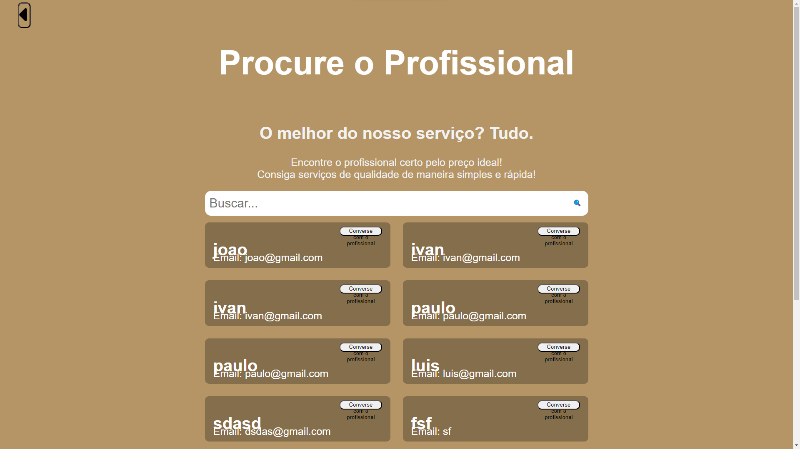
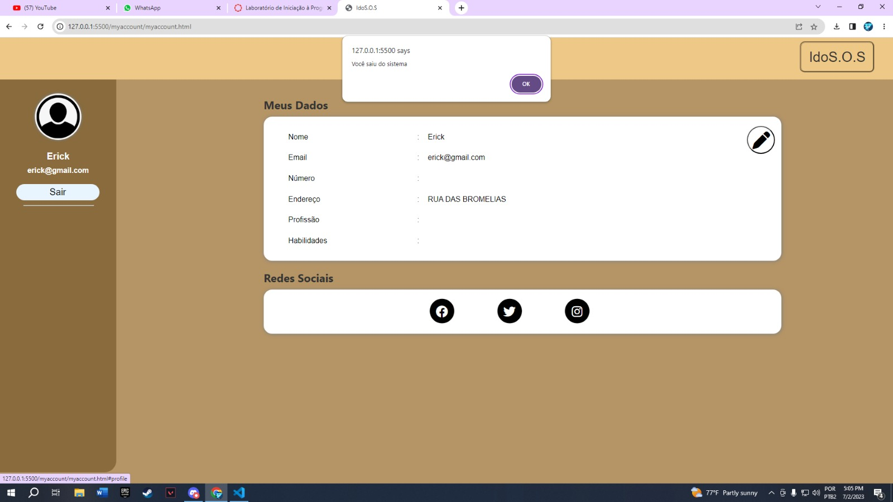

# Informações do Projeto
`TÍTULO DO PROJETO`  

IdoS.O.S 

`CURSO` 

Ciências da Computação - PUC Minas Coreu

## Participantes

Os membros do grupo sao: 
-Lucas Alkmim Barros 
-Daniela Santos Nacur 
-Livia Camara Xavier 
-Erick Toshio Scarpelli Yamada

# Estrutura do Documento

- [Informações do Projeto](#informações-do-projeto)
  - [Participantes](#participantes)
- [Estrutura do Documento](#estrutura-do-documento)
- [Introdução](#introdução)
  - [Problema](#problema)
  - [Objetivos](#objetivos)
  - [Justificativa](#justificativa)
  - [Público-Alvo](#público-alvo)
- [Especificações do Projeto](#especificações-do-projeto)
  - [Personas, Empatia e Proposta de Valor](#personas-empatia-e-proposta-de-valor)
  - [Histórias de Usuários](#histórias-de-usuários)
  - [Requisitos](#requisitos)
    - [Requisitos Funcionais](#requisitos-funcionais)
    - [Requisitos não Funcionais](#requisitos-não-funcionais)
  - [Restrições](#restrições)
- [Projeto de Interface](#projeto-de-interface)
  - [User Flow](#user-flow)
  - [Wireframes](#wireframes)
- [Metodologia](#metodologia)
  - [Divisão de Papéis](#divisão-de-papéis)
  - [Ferramentas](#ferramentas)
  - [Controle de Versão](#controle-de-versão)
- [**############## SPRINT 1 ACABA AQUI #############**](#-sprint-1-acaba-aqui-)
- [Projeto da Solução](#projeto-da-solução)
  - [Tecnologias Utilizadas](#tecnologias-utilizadas)
  - [Arquitetura da solução](#arquitetura-da-solução)
- [Avaliação da Aplicação](#avaliação-da-aplicação)
  - [Plano de Testes](#plano-de-testes)
  - [Ferramentas de Testes (Opcional)](#ferramentas-de-testes-opcional)
  - [Registros de Testes](#registros-de-testes)
- [Referências](#referências)

# Introdução

## Problema

 O envelhecimento da população é uma complexidade de diferentes pontos de vista e é tratado de forma coletiva, porem todos os idosos possuem sua individualidade na maneira de agir, entender e, principalmente, a individualidade na sua condição de vida. O idoso, apesar de ter dificuldades em se readaptar em novas rotinas e situações, alguns ainda o fazem ou tem interesse em fazer. A necessidade do nosso projeto surge do momento em que os idosos começam a perder características cognitivas, físicas e mentais e, consequentemente os problemas do dia a dia enfrentados por eles se intensificam e a qualidade de vida e a saúde são reduzidas. Falhas na memória, perda de visão e audição, maior estresse e perda de força nas pernas e braços são alguns dos diversos problemas que os idosos passam a ter em certa idade, e que dificultam as atividades importantes de casa no dia a dia, como ir no supermercado e consertar objetos em casa, que acabam se tornando tarefas perigosas e podem compromete-los. Com isso, nosso projeto visa ajudar e simplificar os problemas que toda essa parcela da população tem.

## Objetivos

Objetivo geral: desenvolver um software que visa resolver de maneira pratica as dificuldades dos idosos em realizar as tarefas do dia a dia.
Objetivos específicos: 
-Facilitar a busca dos idosos por profissionais próximos que visam atender suas demandas. 
-Organizar de maneira pratica nosso site para facilitar o uso por idosos. 
-Ordenar através de um calendário as tarefas marcadas como forma de lembrete. 
-Aplicar busca por categorias contendo filtros para aumentar a praticidade. 
-Avaliar os profissionais com estrelas para indicar a qualidade do trabalho feito pelo trabalhador. 
-Criar um chat entre cliente e profissional para mais organização, segurança e facilidade para marcar o trabalho.

## Justificativa

 A escolha do projeto que estamos trabalhando foi impulsionado tanto por relatos pessoais como também por pesquisas feitas pelo grupo para maior aprofundamento do assunto em questão. Ao analisarmos a dor e a situação enfrentada por essa parcela da população, vimos a necessidade de criar um projeto que facilitasse a vida dos idosos utilizando da tecnologia. Com isso a função do nosso projeto visa tanto a acessibilidade dos idosos para procurar ajuda em suas tarefas, como também disponibilizar aos trabalhadores atendimentos específicos. Assim, o projeto terá foco para idosos e prestadores de serviços, contribuindo para o contato entre os mesmos. 
 Fizemos entrevistas para identificarmos melhor a dor das personas do nosso projeto, abaixo colocamos uma das entrevistas que fizemos: 
Entrevista com Perguntas: 

- Boa tarde, tudo bem!? Nós somos estudantes de C.C na PUC, e estamos realizando um trabalho na faculdade com objetivo de entender o comportamento das pessoas. Se você não se sentir à vontade para responder alguma coisa não se sinta pressionado. 

---“olá, tudo bem sim. Ok” 

- O que você gosta de fazer no seu dia a dia? 
--“eu gosto de ver filmes com meu gato e adoro fazer crochê”. 

- Sério? Que legal, a minha vó também faz isso! E você tem alguma dificuldade para fazer isso? 
--“Com isso não, não faço esforço pois fico sentada e acomodada”. 

- Caso não: Mesmo?! Teve alguma outra tarefa que você teve dificuldade pra fazer, por exemplo, ir ao supermercado, padaria? (improviso história da vó) 
--“sim, tenho muita dificuldade de ficar muito tempo em pé e sair de casa, e vou poucas vezes comprar as coisas de cozinha por causa disso”. 

- Caso sim: Entendi, o nosso projeto busca entender essas dificuldades e facilita-las, você acha isso interessante? 

---“acho interessante, ia ficar feliz de ter uma pessoa quando eu preciso ir fazer compras”. 

- Ótimo! Qual a sua opinião a respeito de ter pessoas que apoiem as outras em tarefas diárias? 
--“Acho legal, mas é difícil achar alguém que esteja disponível e confiável pra me ajudar”. 

- (História vó). Isso é interessante ne?! Você gostaria de ter esse tipo de ajuda? 
--“gostaria de ter, ia ser bem mais fácil”. 

- Entendi, e você tem alguma facilidade com aparelhos eletronicos? Porque? (improviso historia do tia) 
--“minha filha me deu um celular, mas tenho dificuldade para mexer, geralmente entro para jogar buraco mas não sei as outras funcionalidades do aparelho”. 

- Caso sim: Legal! É que eu estou desenvolvendo um aplicativo justamente para questõres como essa, que busque ajudar na realização de tarefas. Quais as principais tarefas de casa ou pessoais que você tem alguma dificuldade e gostaria de alguma ajuda? 

---"que legal.Bom aqui em casa tenho dificuldade para limpar a casa, não consigo abaixar e tenho medo de escorregar.Tambem não consigo cozinhar muito pois eu fico com dores na perna e esqueço de as vezes desligar o fogão”. 

- Beleza! Muito obrigado pelas respostas, espero que nosso projeto consiga ajudar pessoas como você. 

## Público-Alvo

 Nosso site foi pensado para pessoas idosas utilizarem. Dessa forma, para abranger pessoas com pouco ou razoável conhecimento sobre tecnologias será um website de fácil acesso e com uma linguagem simples. Além disso, foi considerado possíveis dificuldades que atrapalhariam o usuário como visão prejudicada e dificuldade para se locomover. Para isso, o site terá letras maiores e botões mais perceptíveis.  Nossa interface também tem o foco para pessoas mais jovens que pretendem ajudar pessoas mais velhas e até mesmo profissionais que buscam uma forma de rendimento e querem oferecer seu trabalho. Um exemplo é uma senhora, de 71 anos, aposentada, que gosta de cozinhar, mas por dificuldade de mobilidade não consegue ir sozinha ao supermercado e vai buscar em nosso site uma pessoa disposta a ajuda-la nessa tarefa. 

# Especificações do Projeto

 Nesta parte do documento apresentamos nossas três personas, seus quadros de empatia e a proposta de valor que fazem parte do processo de design thinking do trabalho. As ferramentas utilizadas para a realização desta parte foram o Miro, this person does not exist e entrevistas para definição das personas. Além disso criamos as histórias de usuários do projeto baseado nos sites "Atlassian" e "Medium". Também decidimos sobre os requisitos funcionais e não funcionais que o nosso site apresentará. Utilizamos como inspiração o blog "trybe".

## Personas, Empatia e Proposta de Valor

 As três personas do nosso projeto possuem as suas próprias individualidades, porém, possuem diversos aspectos em comum e que os levam à mesma necessidade. Velma, Francisco e Roselene tem algum tipo de intimidade com aparelhos eletrônicos, também sentem a necessidade de ajuda de profissionais para facilitar o dia a dia, visto que eles têm ou conhecem um familiar com algum tipo de deficiência cognitiva, fisica ou mental que dificulte a realização dessas tarefas. 
Ao analisar os mapas de empatia das três personas, percebe-se que possuem objetivos e pensamentos parecidos, no qual prezam por uma vida social e um bom convívio entre amigos e familiares. 
 Os principais envolvidos com a solução do nosso projeto: 
-trabalhadores: são os profissionais qualificados, que também terão acesso ao nosso site, com o intuito de fazer serviços específicos aos idosos. 
-familiares dos idosos: são as pessoas próximas dos nossos cliente e que têm mais intimidade com aparelhos eletrônicos, com isso já possuem o hábito de ajudar os idosos e, caso haja necessidade, conseguem auxiliar no processo de buscar ajuda profissional.

**Personas**

 

**Proposta de Valor**

## Histórias de Usuários

Com base na análise das personas forma identificadas as seguintes histórias de usuários:

|EU COMO... `PERSONA`| QUERO/PRECISO ... `FUNCIONALIDADE` |PARA ... `MOTIVO/VALOR`                                 |
|--------------------|------------------------------------|--------------------------------------------------------|
|                    |  Filtro                            |  Achar facilmente o profissional ideal                 |
|                    |  Calendário                        |  Lembrar quando o serviço foi marcado                  |
|      Cliente       |  Chat                              |  Combinar o encontro e obter mais segurança            |
|                    |  Avaliar o profissional            |  Recomenda-lo ou não para outros clientes              |
|                    |  Entrar no perfil do profissional  |  Ver as informações básicas e a nota do profissional   |
|                    |  letras grandes/ Interface simples |  Facilitar o uso do site                               |
|--------------------|------------------------------------|--------------------------------------------------------|
|                    |  Avaliar o cliente                 |  Escolher se quero ou não trabalhar para esse cliente  |
|    Profissional    |  Entrar no perfil do cliente       |  Ver as informações básicas e a nota do cliente        |
|                    |  Chat                              |  Combinar dia, preço e local                           |
|--------------------|------------------------------------|--------------------------------------------------------|

## Requisitos

As tabelas que se seguem apresentam os requisitos funcionais e não funcionais que detalham o escopo do projeto.

### Requisitos Funcionais

|ID    | Descrição do Requisito  | Prioridade |
|------|-----------------------------------------|----|
|RF-001| Permitir que o usuário filtre o tipo de trabalho | ALTA | 
|RF-002| Chat entre profissional e cliente | MÉDIA |
|RF-003| Avaliação dos usuários | MÉDIA |
|RF-004| Agenda para marcação dos compromissos | MÉDIA |
|RF-005| Cadastro dos usuários e trabalhadores | ALTA |
|RF-006| Possibilidade de visitar o perfil dos usuários  | BAIXA |

### Requisitos não Funcionais

|ID     | Descrição do Requisito  |Prioridade |
|-------|-------------------------|----|
|RNF-001| Atualizações semanais que irão excluir trabalhadores com baixas avaliações | MÉDIA | 
|RNF-002| Interface simples e intuitiva |  ALTA | 
|RNF-003| Banco de dados dos usuários  | ALTA |
|RNF-004| Alta segurança para que as informações sejam protegidas  | ALTA |
|RNF-005| Disponibilidade 24 horas do site  | BAIXA |
|RNF-006| Backup automático das conversas do chat  | BAIXA |

## Restrições

|ID| Restrição                                             |
|--|-------------------------------------------------------|
|01| A sprint 1 deve ser entregue ate dia 16/04            |
|02| O projeto deverá estar em conformidade com os parâmetros instituídos pelos professores para a sprint 1     |
|03| Os membros da equipe não possuem disponibilidade de realizar o trabalho durante a tarde, devido a compromissos externos    |

# Projeto de Interface

Visando um site mais acessivel para idosos, colocamos ferramentas mais intuitivas, além de interface mais simplificada, também focamos em deixar as fontes maiores, para que nosso público-alvo tenha uma experiência mais agradável. Ademais, colocamos utensílios que agradem tanto o cliente(idoso), quanto o profissional(trabalhador), como filtros para pesquisa, chats para interação cliente-trabalhador, possibilidade de avaliação e um calendário para melhor organização. 

## User Flow

## Wireframes

-Tela Principal: Tela inicial do site, dela é possivel acessar as abas sobre nós, contato, login, minha conta, mensagens, filtros e calendario, além disso, visando maior facilidade de uso para idosos, buscamos faze-la mais intuitiva.
 
  -Tela Sobre Nós: Tela que fala sobre os desenvolvedores do site.
 
  -Tela Contatos: Tela que informa as possiveis formas de contato cliente-desenvolvedor.
 
  -Telas Chat: Tela na qual o usuário tem acesso as pessoas que ele conversa, ao clicar na pessoa, é aberto a tela de chat, em que é possivel ter uma relação direta cliente-trabalhador.
 
 
  -Tela Perfil Traabalhador: É possivel acessar essa tela clicando no nome da pessoa que voce está conversando (pelo chat interno). A tela mostra as informações do trabalhador.
 
  -Tela Finalizar Serviço: Tela para encerrar o serviço e avaliar o trabalhador. Acessada após o serviço ser feito.
 
  -Tela Login: Tela onde é possível fazer o login.
 
  -Tela Registrar Idoso: Tela na qual os clientes(idosos) vão se registrar. Acessada pela tela de login.
 
  -Tela Registrar Trabalhador: Tela na qual os clientes(trabalhadores) vão se registrar. Acessada pela tela de login.
 
  -Tela Pesquisa: Essa tela vai aparecer após o cliente selecionar os filtros e clicar em "buscar" na tela princiapal. Nessa tela, vão aparecer os trabalhadores que são compatíveis com os filtros requisitados, além de mostrar o valor, a avaliação média do trabalhador, e um botão que possibilita um chat com o trabalhador.
 
  -Tela Calendário: Acessada após clicar no calendário da tela principal, nela é possivel seleceionar um dia especíco. Ao selecionar o dia, a "Tela Dia" será aberta, a qual mostrará as informações daquele dia.
 
 
  -Tela Minha Conta: Tela que mostra as informações do próprio cliente, ao clicar no icone de lápis, voce poderá editar suas informações.
 

# Metodologia

Nosso grupo se reunia todas as sextas-feiras, pela ferramenta "Discord", para definir as tarefas que seriam realizadas, por cada um, durante a semana. Nas sexta-feiras seguintes, apresentavamos os trabalhsos feitos, em que opinavamos a respeito do serviço de cada um, apresentando todos os pontos positivos e negativos, assim, o ciclo se repetia. Ademais, também nas sextas-feiras, durante as reuniões, a equipe entrava nos ambientes de trabalho "Miro", "Canva" e "Marvel" para a realização do processo de Desing Thinking e para o mapeamento dos Wireframes.

## Divisão de Papéis

Daniela Nacur: Contexto do Projeto, Metodologia. 
Erick Yamada: Projeto de Interface, Especificações do projeto. 
Lívia Xavier: Metodologia, Contexto do Projeto. 
Lucas Alkmim: Projeto de Interface, Especificações do projeto. 

## Quadro de Controle de Tarefas

## Ferramentas

| Ambiente  | Plataforma              |Link de Acesso |
|-----------|-------------------------|---------------|
|Processo de Design Thinkgin  | Miro |  [https://miro.com/app/board/uXjVMU67v40=/](https://miro.com/app/board/uXjVMU67v40=/) | 
|Repositório de código | GitHub | [https://github.com/ICEI-PUC-Minas-PMGCC-TI/ti-1-pmg-cc-m-20231-tiaw-acessibilidade-idososo](https://github.com/ICEI-PUC-Minas-PMGCC-TI/ti-1-pmg-cc-m-20231-tiaw-acessibilidade-idososo) | 
|Hospedagem do site | Heroku |  https://XXXXXXX.herokuapp.com | 
|Protótipo Interativo | MavelApp ou Figma | [https://marvelapp.com/prototype/882c0fc](https://marvelapp.com/prototype/882c0fc) | 

## Controle de Versão

O controle foi feito pelo GIT

......  COLOQUE AQUI O SEU TEXTO ......

> Discuta como a configuração do projeto foi feita na ferramenta de
> versionamento escolhida. Exponha como a gerência de tags, merges,
> commits e branchs é realizada. Discuta como a gerência de issues foi
> realizada.
> A ferramenta de controle de versão adotada no projeto foi o
> [Git](https://git-scm.com/), sendo que o [Github](https://github.com)
> foi utilizado para hospedagem do repositório `upstream`.
> 
> O projeto segue a seguinte convenção para o nome de branchs:
> 
> - `master`: versão estável já testada do software
> - `unstable`: versão já testada do software, porém instável
> - `testing`: versão em testes do software
> - `dev`: versão de desenvolvimento do software
> 
> Quanto à gerência de issues, o projeto adota a seguinte convenção para
> etiquetas:
> 
> - `bugfix`: uma funcionalidade encontra-se com problemas
> - `enhancement`: uma funcionalidade precisa ser melhorada
> - `feature`: uma nova funcionalidade precisa ser introduzida
>
> **Links Úteis**:
> - [Tutorial GitHub](https://guides.github.com/activities/hello-world/)
> - [Git e Github](https://www.youtube.com/playlist?list=PLHz_AreHm4dm7ZULPAmadvNhH6vk9oNZA)
> - [5 Git Workflows & Branching Strategy to deliver better code](https://zepel.io/blog/5-git-workflows-to-improve-development/)
>
> **Exemplo - GitHub Feature Branch Workflow**:
>
> 

# **############## SPRINT 1 ACABA AQUI #############**

# Projeto da Solução

## Tecnologias Utilizadas

Usaremos ferramentass HTML, CSS e JS para deixar o nosso site mais organizado e responisvo. As ferramentas Miro, Canva, Marvel e VScode vão nos ajudar a realizar isso.
Flow map:
> 
> Página principal:
> 
> Sobre nós:
> 
>  Login e cadastros:
> > 
> 
> 
> > Minha conta:
> 
>  chat e busca por trabalhadores:
> 
> 
> 
> > Calendario:
> 

> Descreva aqui qual(is) tecnologias você vai usar para resolver o seu
> problema, ou seja, implementar a sua solução. Liste todas as
> tecnologias envolvidas, linguagens a serem utilizadas, serviços web,
> frameworks, bibliotecas, IDEs de desenvolvimento, e ferramentas.
> Apresente também uma figura explicando como as tecnologias estão
> relacionadas ou como uma interação do usuário com o sistema vai ser
> conduzida, por onde ela passa até retornar uma resposta ao usuário.
> 
> Inclua os diagramas de User Flow, esboços criados pelo grupo
> (stoyboards), além dos protótipos de telas (wireframes). Descreva cada
> item textualmente comentando e complementando o que está apresentado
> nas imagens.

## Arquitetura da solução

O cliente, navegando pelas nossas páginas web (HTML, CSSS e JS), por meio do site que será hospedado no Heroku, terá os dados salvos no nosso local storage. Inicialmente esses dados serão obtidos ao cadastro do cliente, entrentanto, os dados também serão utilizados em páginas como a do calendário, chat, minha conta, etc.
> 
> 
> 

# Avaliação da Aplicação

> 
> 
> 
> 

## Plano de Testes

Os usuários avaliaram as páginas de Login/Cadastro, avaliação, busca e calendário. O grupo de usuário foram desde idosos (majoritariamente), até jovens estudantes da computação. Eles fizeram isso testando diretamente as funcionalidades que estavam hospedadas na netlify.

## Ferramentas de Testes (Opcional)

> Comente sobre as ferramentas de testes utilizadas.
> 
> **Links Úteis**:
> - [Ferramentas de Test para Java Script](https://geekflare.com/javascript-unit-testing/)
> - [UX Tools](https://uxdesign.cc/ux-user-research-and-user-testing-tools-2d339d379dc7)

## Registros de Testes

Por meio dos testes propostos para os nossos clientes, identificamos alguns problemas lógicos no local storage, os quais ja foram corrigidos. Além disso conseguimos otimizar o site, aumentando as fontes das palavras (a fim de facilitar a leitura para os idosos), e mudando algumas cores (com o objetivo de aumentar o contraste e facilitar a navegação). Ainda pretendemos deixar o site mais rersponsivo, intuitivo e organizado, para que um idoso nãp apresente dúvidas na hora do uso. Ademais, mantemos alguns aspectos que foram bem avaliados, como a facilidade de uso do calendário.

# Referências

[Formato ABNT](https://www.atlassian.com/br/agile/project-management/user-stories)
[Formato ABNT](https://medium.com/vertice/como-escrever-boas-users-stories-hist%C3%B3rias-de-usu%C3%A1rios-b29c75043fac)

> **Links Úteis**:
> - Design para idosos: https://www.smashingmagazine.com/2019/02/designing-digital-interfaces-senior-users/
> - Acessibilidade na web para idosos: https://www.w3.org/WAI/older-users/Overview.html
> - Conteúdo adequado para idosos: https://www.nngroup.com/articles/designing-for-seniors/
> - Local Storage: https://developer.mozilla.org/en-US/docs/Web/API/Window/localStorage
> - Acessibilidade: https://www.w3.org/WAI/standards-guidelines/wcag/.

